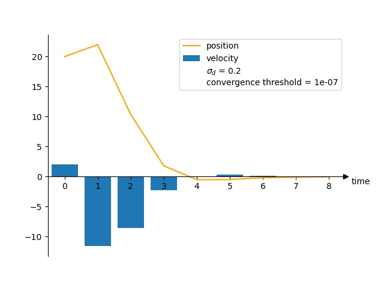

# Markov Decision Process Simulator

A Python library that solves and simulates Markov decision process.

## Requirements

+ python 3.9 or newer
+ numpy
+ matplotlib

## Running

```
python solver.py [-h] [-p P]
                 [-m {pi,policy-iteration,vi,value-iteration,gs,graph-search}]
                 [-v V] [-o O] [--horizon HORIZON] [--gamma GAMMA]
                 [--converge-threshold THR] [--function-approximation]
                 problem

```

Run the script ```solver.py``` and supply it with task name and optional arguments to solve MDP. The arguments are:

+ ```problem```: the identifier of a problem instance. Two Python scripts with same filename are expected to exist under directories ```problem/``` and ```visualizer/```. For example, if a problem instance is given as ```finiteStateMachine```, there must be files ```problem/finiteStateMachine.py``` and ```visualizer/finiteStateMachine.py```.
+ ```-p```: alternative problem definition that overrides that deduced from the argument ```problem```.
+ ```-v```: alternative problem visualizer that overrides that deduced from the argument  ```problem```.
+ ```-o```: filename of output image. The image generated by visualizer will be under the directory ```images/```.
+ ```-m```: method used to solve MDP. Currently supported methods are
 + ```pi```: policy iteration
 + ```vi```: value iteration
 + ```gs```: graph search
 + ```LQR```: linear quadratic regulator
+ ```--horizon```: horizon of reward. -1 for infinite horizon.
+ ```--gamma```: discount factor of reward, should be a real number between (not including) 0 and 1.
+ ```--converge-threshold```: the extent of convergence we want for our numerical method (when applicable). Usually 0.1 is a good start. The smaller the number is, the more computation the solver does.
+ ```--function-approximation```: enables function approximation (definition provided by user) when ```-m``` is set to ```vi```.

# User-defined Problems

As a generic MDP solver, it is able to solve any problems that are defined by anyone. The solver provides several algorithms and an interface that allows users to define problems without worrying about the implementation detail of algorithms.

## Model and Implementation

An MDP, involving rewards and discounting factors, can be described by a 6-tuple: (S, A, P, R, H, γ) where

+ S is the state space, the set of all possible states of the environment.
+ A is the action space, the set of all possible actions of the agent.
+ P is the transition probability, the probability of the next state given current state and action.
+ R is the reward function, the reward given to the agent given current state and action.
+ H is the horizon, the number of steps the agent can take.
+ γ is the discounting factor that discounts rewards further in the future.

There are some mathematical concepts that can be reused in Python, and we implement these functions while abiding by the following constraints:

+ ```P``` must be callable, receives two arguments ```s``` and ```a```, and returns a probabilistic distribution of type ```list``` and length equal to ```len(S)```. The library provides a class ```common.simulator.Transition``` for inheritence.
+ ```S``` and ```A``` must be of type ```list``` but their content is not restricted as long as ```P``` handles their elements well.
+ ```R``` must be a callable object that takes three arguments ```s'```, ```s```, and ```a```, and return a real number.
+ These are packed into a dictionary ```env``` and to be accessed with the key synonymous as their value. For example, ```env['P']``` returns the transition probatility ```P```. Additional information can be included into ```env``` for future use. Some methods may require additional information such as initial state.

## Workflow

The library has four components: the top-level solver, the method, the problem instance, and the visualizer. The workflow can be described by the pseudocode:

```
def solver(param):
    p = import(param.problemIdentifier)
    m = import(param.method)
    v = import(param.visualizer)
    v(m(p, param), p, param)
```

Specified method, problem instance, and visualizer are fetched from subdirectories. The problem instance and relevant parameters are then feed into the method, which produces results that can be visualized by visualizer.

An agreement must be made between these modules in order to complete tasks without too much concern of their details. The function signature of ```p```, ```m```, and ```v``` are:

```
p: () -> (env: dict)
m: (env: dict, H: int, gamma: float, thr: float) -> (pi: np.array, V: np.array)
v: (pi: np.array, V: np.array, env: dict, H: int, gamma: float, thr: float, filename: str):
```

In addition, there must be a function ```solve``` under the module ```m``` and a function ```visualize``` under the module ```v```.

Although ```m``` returns a tuple ```(pi, V)```, the content of these objects may differ from what these names suggest. Method ```gs``` returns ```pi``` as parents of each vertex in a (tree deduced from) graph. Method ```LQR``` returns ```pi``` as the trajectory of state.

# Gallery

Grid-world problem solved using policy iteration:


Grid-world problem solved using value iteration:


Using LQR to drive the robot back to origin:



<!-- press control+shift+M for markdown preview -->
