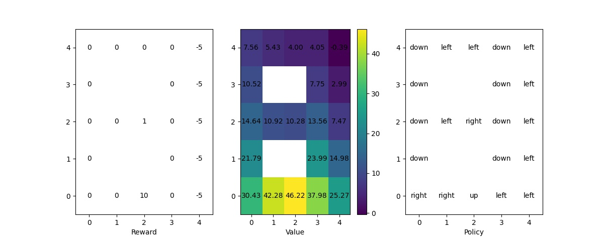
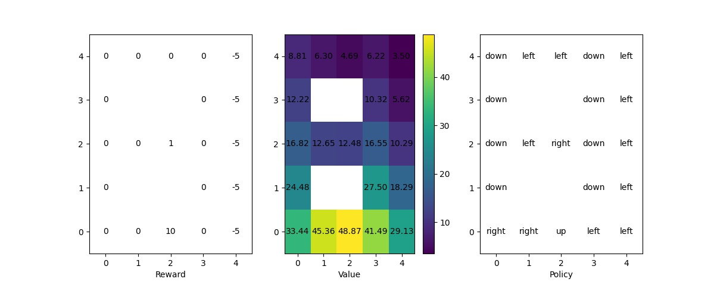

# Markov Decision Process Simulator

A Python library that solves and simulates Markov decision process.

## Requirements

+ python 3.8 or newer
+ numpy
+ matplotlib

## Running

```
python solver.py [-h] [-p P]
                 [-m {pi,policy-iteration,vi,value-iteration,gs,graph-search}]
                 [-v V] [--horizon HORIZON] [--gamma GAMMA]
                 [--converge-threshold THR] [--function-approximation]
                 problem

```

Run the script ```solver.py``` and supply it with task name and optional arguments to solve MDP. The arguments are:

+ ```problem```: the identifier of a problem instance. Two Python scripts with same filename are expected to exist under directories ```problem/``` and ```visualizer/```. For example, if a problem instance is given as ```finiteStateMachine```, there must be files ```problem/finiteStateMachine.py``` and ```visualizer/finiteStateMachine.py```.
+ ```-p```: alternative problem definition that overrides that deduced from the argument ```problem```.
+ ```-v```: alternative problem visualizer that overrides that deduced from the argument
+ ```-m```: method used to solve MDP. Currently supported methods are
 + ```pi```: policy iteration
 + ```vi```: value iteration
 + ```gs```: graph search
+ ```--horizon```: horizon of reward. -1 for infinite horizon.
+ ```--gamma```: discount factor of reward, should be a real number between (not including) 0 and 1.
+ ```--converge-threshold```: the extent of convergence we want for our value function. Usually 0.1 is a good start. The smaller the number is, the more computation the solver does.
+ ```--function-approximation```: enables function approximation (definition provided by user) when ```-m``` is set to ```vi```.

# User-defined Problems

As a generic MDP solver, it is able to solve any problems that are defined by anyone, as long as they abide to several rules.

## Modeling and Implementing the Process

A MDP, involving rewards and discounting factors, can be described by a 6-tuple: (S, A, P, R, H, γ) where

+ S is the state space, the set of all possible states of the environment.
+ A is the action space, the set of all possible actions of the agent.
+ P is the transition probability, the probability of the next state given current state and action.
+ R is the reward function, the reward given to the agent given current state and action.
+ H is the horizon, the number of steps the agent can take.
+ γ is the discounting factor that discounts rewards further in the future.

There are some mathematical concepts that can be reused in Python, and we implement these functions while abiding by the following constraints:

+ ```P``` must be callable, receives two arguments ```s``` and ```a```, and returns a probabilistic distribution of type ```list``` and length equal to ```len(S)```. The library provides a class ```Transition``` for inheritence.
+ ```S``` and ```A``` must be of type ```list``` but their content is not restricted as long as ```P``` handles their elements well.
+ ```R``` must be a callable object that takes three arguments ```s'```, ```s```, and ```a```, and returns a number.
+ ```H``` and ```gamma``` are constants. ```gamma``` should be in the range (0, 1).

## Interface

The library provides the interface ```Environment``` that users can interact with. The interface is located at ```common/simulator.py```. The methods available are:

```
Environment(S, A, P, O, R)
```

The object instantiation method that creates an ```Environment``` object with necessary information. Note that there is a slot for observation ```O``` but it will be of no use at current time.

```
Environment.step(a) -> type(R)
```

A method that changes the current state of the environment according to the given action ```a```. The next state is computed by calling ```P```, and the method returns the corresponding reward. The state of the environment can be accessed with ```Environment.state```.

```
Environment.initialize(s)
```

A method that sets the initial state of the environment to the given argument ```s```.

```
Environment.task(H, gamma)
```

A method that provides the environment with information necessary for policy iteration and value iteration.

```
Environment.policyIteration()
```

A method that computes value and policy based on policy iteration, both of which can be accessed with ```Environment.V``` and ```Environment.pi```.

```
Environment.valueIteration()
```

A method that computes value and policy based on value iteration, both of which can be accessed with ```Environment.V``` and ```Environment.pi```.

(In the future) There are also functions under ```common/``` that can be used at your convenience.

# Gallery

Gridworld problem solved using policy iteration:



Gridworld problem solved using value iteration:



<!-- press control+shift+M for markdown preview -->
